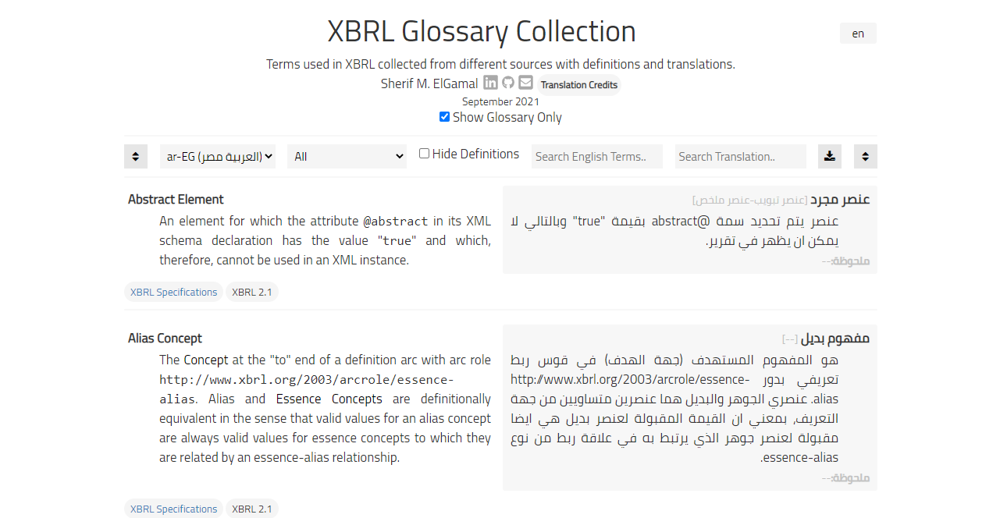

# XBRL Glossary Collection
A collection of XBRL terminology and definitions in one place, along with translations if available.  

[](https://selgamal.github.io/xbrl-glossary-collection/xbrl-glossary-collection.html)

Initial translation is in Arabic (ar-EG), but more translations can be added as follows:

```bash
# create a translation file for the new language (lang name and symbol as in http://www.lingoes.net/en/translator/langcode.htm)
python page-build.py --make-lang --lang-symbol xx-XX --lang-name Abcd --lang-direction [rtl, ltr] --translator-name <optional> --translator-email <optional>  --translator-linkedin <optional> --translator-github <optional>
```
The language file should be saved under `./json/langs/xx-XX.json`, open the file and start entering translations as follows:
```json
    "intro": {
        "doc-title": {
            "en": "XBRL Glossary Collection",
            "xx-XX": "<translation in language>" 
        },

    "glossary": {
        "9aad2f2a700782daf15eb2c734d1ab70": {
            "term-name": "Abstract Element",
            "term-definition": "An element for which the attribute @abstract .......",
            "term-name-lang": "term-name in language",
            "term-name-lang-variants": ["< other acceptable translations for the name if any>"], 
            "term-definition-lang": "<term-definition in language >", 
            "translation-notes": "notes specific to this translation if any." 
        },
```
When done with the translation, run the following command to merge the translation and render html page

```bash
# requires jinja2
python page-build.py --make-langs --make-page -o
```
## Usage
This material is personal effort for personal reference, the materials and all attached files and included code are PROVIDED "AS IS", WITHOUT WARRANTY OF ANY KIND, EXPRESS OR IMPLIED.
